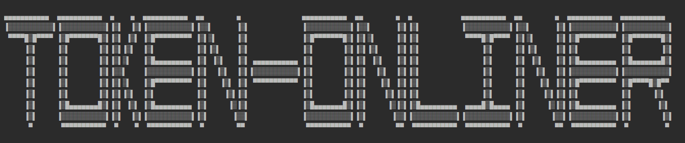

  <h2>Discord Token Onliner</h2>
  
A simple and quick program to mass create sessions using Discord tokens.

  

---

## ⚙️ Usage

1. **Install Python 3.10+**  
   Download and install Python 3.10 or higher from [python.org](https://www.python.org/downloads/).

2. **Add Tokens**  
   Place your Discord tokens in a file named `tokens.txt` with one token per line.

3. **Run the Program**  
   Execute the `start.bat` file to launch the application.

---

## 🔥 Features

- **Simple & Easy Setup:** Minimal configuration required.
- **Fast Performance:** Quickly creates sessions using multiple tokens.
- **Mass Session Creation:** Efficiently manage and run multiple token sessions.

---

## ❗ Disclaimers

- **Risk Acknowledgment:**  
  The author is not responsible for any consequences (e.g., API blocking, account termination) that may result from using this program.

- **Performance Impact:**  
  This application **may** affect your internet speed and/or host computer performance.

---

Enjoy using **Discord Token Onliner**!
